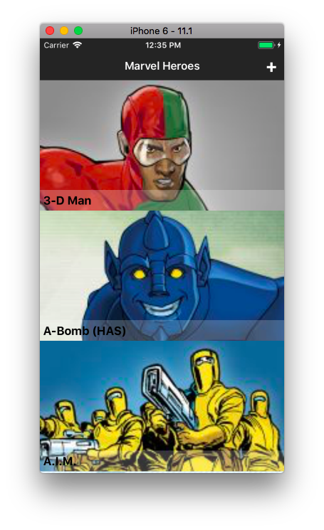
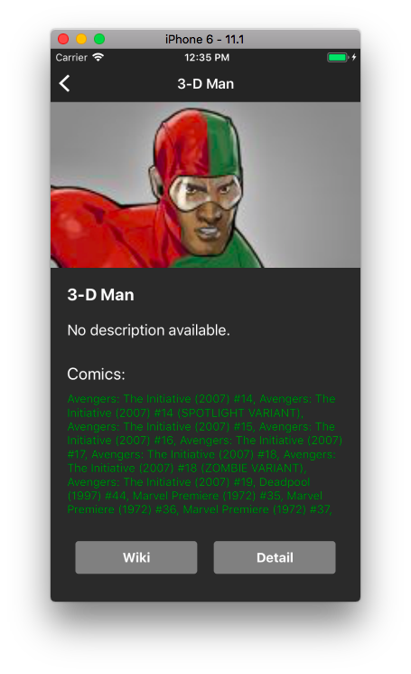
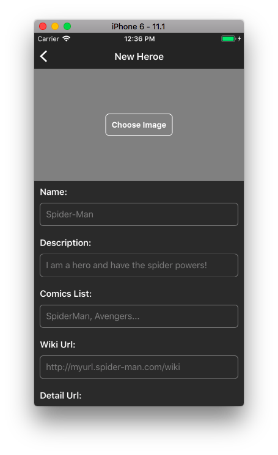
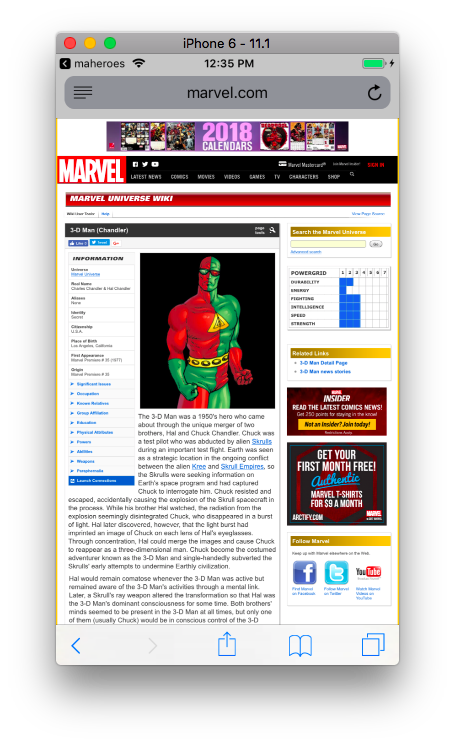

# MAHEROES
Marvel application that shows a list of the characters and the comics in which each character appears. Use marvel api: [Marvel APi](https://developer.marvel.com/docs#!/public/getCharacterIndividual_get_1).

## Table of contents
- [Requirements](#requirements)
- [Install](#install)
- [Technologies](#technologies)
- [Architecture](#architecture)

CharList | CharDetail | AddChar | Browser
----- | ----- | ----- | ----- 
 |  |  | 

## Requirements
You must have installed the following:
- *Node*: `brew install node` to install.
- *Watchman*: `brew install watchman` to install.
- *React-Native*: `npm install -g react-native-cli` to install.

The app use iOS 11.1 and Android 8.1.

## Install
- Download master branch.
- Navigate into directory.
- Type: `npm install` to install all modules and dependencies.
- Type: `npm start` to run node server.
- In other tab but in the same directory, type: `react-native run-ios` or `react-native run-android` to launch device simulator.
- That's all!

## Technologies
***Maheroes*** use the following modules:
- [*Axios*](https://github.com/axios/axios)
- [*qs*](https://github.com/ljharb/qs)
- [*react-native-elements*](https://github.com/react-native-training/react-native-elements)
- [*react-native-image-picker*](https://github.com/react-community/react-native-image-picker/blob/develop/README.md)
- [*react-native-router-flux*](https://github.com/aksonov/react-native-router-flux)
- [*react-native-spinkit*](https://github.com/maxs15/react-native-spinkit)
- [*react-native-vector-icons*](https://github.com/oblador/react-native-vector-icons)
- [*react-redux*](https://github.com/reactjs/react-redux)
- [*redux*](https://github.com/reactjs/redux)
- [*redux-thunk*](https://github.com/gaearon/redux-thunk)

## Architecture
***Maheroes*** uses a Flux architecture using redux. Only one reducer is needed to manage the entire app. Also the app use their own widgets as buttons or inputs boxes.

## IMPORTANT! *Create new char* is mocked because the API used don't support POST requests.

---
###### *© 2017 Miguel Jardón.*